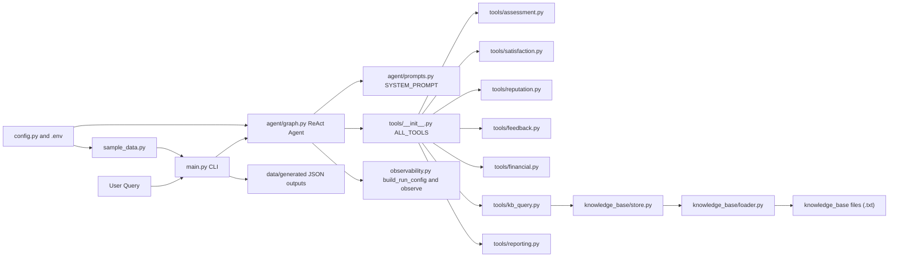
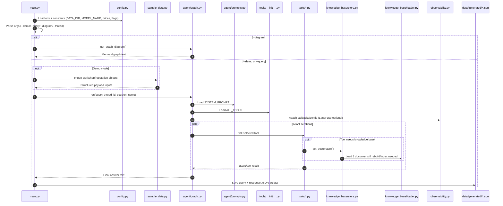
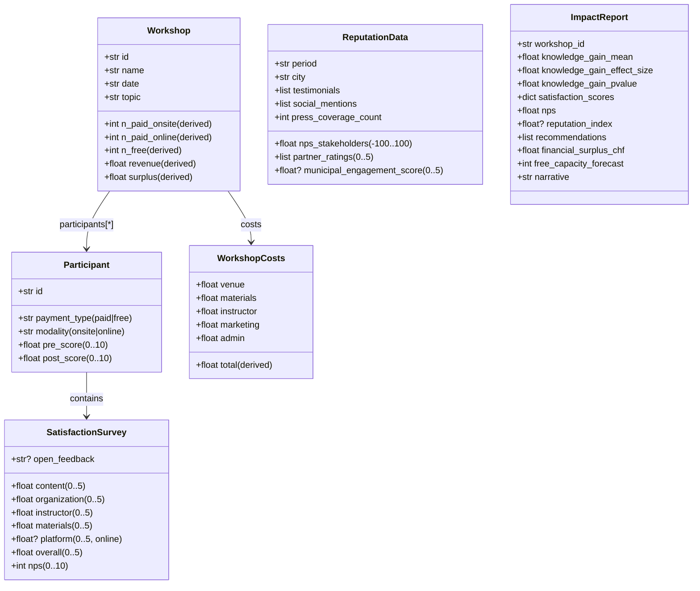
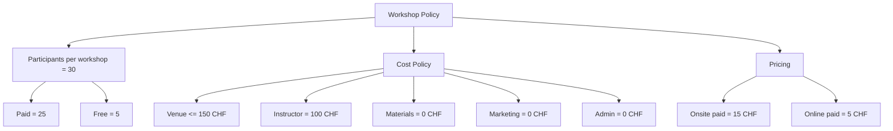

# Impact Measurement Agent

Production-grade impact analytics + reasoning agent for a digital-skills nonprofit programme in Geneva.

Stack: Python, LangGraph ReAct, LangChain tools, Gemini (`gemma-4-31b-it`), local ChromaDB RAG, optional LangFuse tracing.

---

## What This Project Answers (Q1–Q8)

This repository is organized around 8 programme-evaluation questions:

1. Is the programme financially sustainable?
2. What is participant satisfaction?
3. Do attendees learn?
4. Which workshops are most successful?
5. How much budget is available for the next iteration?
6. How much can free-seat share increase while staying sustainable?
7. How many additional free seats can be funded from Q1 2026 surplus?
8. Which feedback themes should drive improvements?

Notebook mapping:

| Notebook | Questions covered | Analytical lens |
|---|---|---|
| `nb_01_financial_sustainability.ipynb` | Q1, Q5, Q6, Q7 | Revenue/cost/surplus, break-even, free-seat frontier |
| `nb_02_learning_outcomes.ipynb` | Q3 + part of Q4 | Pre/post gain stats, paired tests, effect size |
| `nb_03_satisfaction_reputation.ipynb` | Q2 + part of Q4 | NPS, dimension scores, reputation index |
| `nb_04_feedback_nlp.ipynb` | Q8 | TF-IDF, LDA topics, improvement priorities |

---

## System Architecture



---

## Flow Diagram: What Happens When `main.py` Runs

The diagram below is file-level and execution-ordered.



---

## Project Structure (Updated)

```text
impact_agent/
├── main.py                          # CLI entry point + demo runner + JSON output persistence
├── config.py                        # env settings, model config, pricing, LangFuse flag
├── schemas.py                       # domain data models (Pydantic)
├── sample_data.py                   # 8-workshop synthetic dataset + CSV/JSONL export
├── observability.py                 # LangFuse callbacks / observe decorator
├── requirements.txt
├── README.md
├── README.txt
│
├── agent/
│   ├── prompts.py                   # SYSTEM_PROMPT with domain instructions
│   └── graph.py                     # ReAct agent (run/stream/get_graph_diagram)
│
├── tools/
│   ├── __init__.py                  # ALL_TOOLS registry
│   ├── assessment.py                # learning impact stats
│   ├── satisfaction.py              # NPS + dimension analysis
│   ├── reputation.py                # reputation index logic
│   ├── feedback.py                  # empirical improvement synthesis
│   ├── financial.py                 # Monte Carlo free-seat capacity forecast
│   ├── kb_query.py                  # RAG query tool
│   └── reporting.py                 # markdown impact reporting
│
├── knowledge_base/
│   ├── loader.py                    # 8 framework documents
│   ├── store.py                     # ChromaDB init/retrieval
│   └── loader_doc_*.txt             # exported plain-text framework docs
│
├── data/
│   ├── workshops.csv
│   ├── workshop_participants.csv
│   ├── reputation_summary.csv
│   ├── reputation_testimonials.csv
│   ├── reputation_social_mentions.csv
│   ├── upcoming_workshops.csv
│   ├── workshops_structured.jsonl
│   ├── reputation_structured.jsonl
│   ├── upcoming_workshops_structured.jsonl
│   ├── chroma_db/
│   └── generated/                   # demo/custom-query outputs from main.py
│
├── nb_01_financial_sustainability.ipynb
├── nb_02_learning_outcomes.ipynb
├── nb_03_satisfaction_reputation.ipynb
└── nb_04_feedback_nlp.ipynb
```

---

## Rich Domain Schemas (Updated)

### 1) Pydantic Domain Model (`schemas.py`)



### 2) Synthetic Programme Policy Schema (`sample_data.py`)



### 3) Exported Data Schemas (`data/*.csv`)

`workshops.csv`

| Column | Type | Description |
|---|---|---|
| workshop_id | string | Workshop identifier |
| name | string | Workshop name |
| date | date | Workshop date |
| topic | string | Theme/topic |
| participants_total | int | Total participants |
| n_paid_onsite | int | Paid onsite count |
| n_paid_online | int | Paid online count |
| n_free | int | Free-seat count |
| revenue_chf | float | Revenue in CHF |
| cost_venue_chf | float | Venue cost |
| cost_materials_chf | float | Materials cost |
| cost_instructor_chf | float | Instructor cost |
| cost_marketing_chf | float | Marketing cost |
| cost_admin_chf | float | Admin cost |
| total_cost_chf | float | Total cost |
| surplus_chf | float | Revenue - total cost |

`workshop_participants.csv`

| Column group | Fields |
|---|---|
| Identity | workshop_id, workshop_name, workshop_date, participant_id |
| Access | payment_type, modality |
| Learning | pre_score, post_score, knowledge_gain |
| Satisfaction | survey_content, survey_organization, survey_instructor, survey_materials, survey_platform, survey_overall, survey_nps |
| Qualitative | survey_open_feedback |

`reputation_summary.csv`

| Column | Description |
|---|---|
| period, city | Snapshot scope |
| nps_stakeholders | Stakeholder NPS |
| partner_ratings_count, partner_ratings_mean | Partner evaluation summary |
| social_mentions_count, testimonials_count | External voice volume |
| press_coverage_count | Media mentions |
| municipal_engagement_score | Institutional relationship strength |

---

## Tooling Schema (Agent Capability Surface)

| Tool | Inputs (high level) | Output |
|---|---|---|
| `analyze_knowledge_impact` | `workshop_id`, `pre_scores`, `post_scores` | gain stats, p-value, Cohen's d |
| `analyze_satisfaction` | `workshop_id`, survey rows, modality | NPS, dimension means, warnings |
| `measure_reputation` | stakeholder NPS, partner ratings, mentions | reputation index and interpretation |
| `synthesize_feedback_improvements` | multi-workshop feedback + metrics | prioritized improvement actions |
| `calculate_free_workshop_capacity` | historical attendance/costs + upcoming plan | Monte Carlo free-seat forecast |
| `query_knowledge_base` | natural language query | retrieved framework evidence |
| `generate_impact_report` | combined tool outputs | formatted impact narrative |

---

## Setup

### 1) Environment

```bash
python3.12 -m venv .venv312
source .venv312/bin/activate
pip install -r requirements.txt
```

### 2) Configuration

```bash
cp .env.example .env
```

Required keys/vars:

```dotenv
GEMINI_API_KEY=...
MODEL_NAME=gemma-4-31b-it
LANGFUSE_ENABLED=false
ONSITE_PRICE_CHF=15.0
ONLINE_PRICE_CHF=5.0
```

---

## Running

Run all demos:

```bash
set -a && source .env.example && set +a && LANGFUSE_ENABLED=false ./.venv312/bin/python main.py
```

Run one demo:

```bash
./.venv312/bin/python main.py --demo 3
```

Run custom question:

```bash
./.venv312/bin/python main.py --query "How many free seats can we add next quarter?"
```

Generate/refresh tabular data:

```bash
./.venv312/bin/python sample_data.py
```

---

## Outputs Produced by Execution

1. Terminal-rendered markdown responses via `rich`
2. Timestamped JSON artifacts in `data/generated/`
3. If enabled, LangFuse traces/spans/metrics via `observability.py`

---

## Notes

- The repository contains both operational agent code and analysis notebooks.
- For comprehensive interpretation of Q1–Q8, run the notebooks in sequence (`nb_01` to `nb_04`).
- `main.py` demos use scenario payloads from `sample_data.py` and can be re-run safely.

---

## License

MIT
